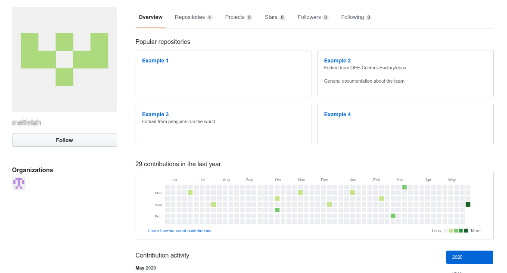
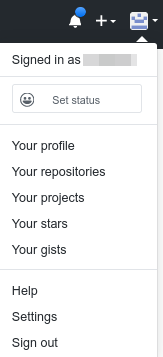
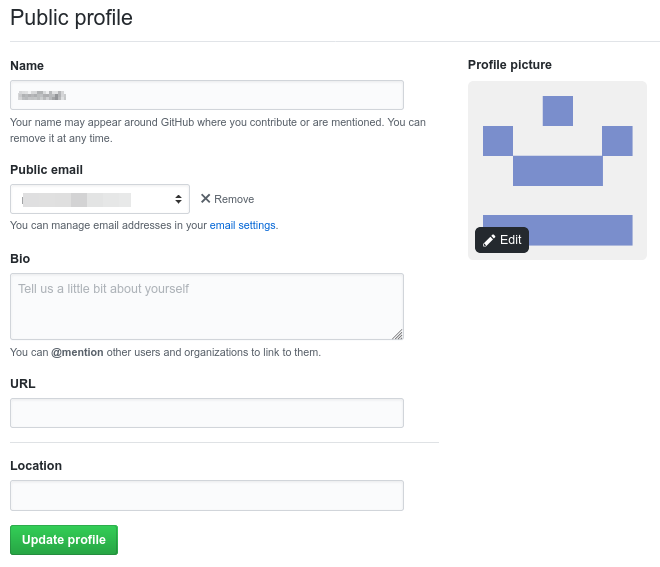
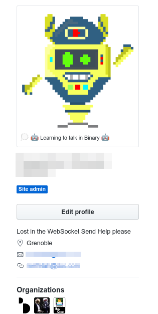

After Getting access to Github, you will be redirected to your profile page that will look like that 

## Customizing your profile

### Personalizing your profile
* In the upper-right corner of any page, click your profile photo, then click Setting

* Under Profile Picture, 🖊️ click Edit to change your profile photo.
* Under **"Name"**, type the name you want to be displayed on your profile. 
* Under **Bio**, add the content that you want displayed on your profile. The bio field is limited to 160 characters. 

## Click Update profile ✔️. 

### Profile Example  after update

