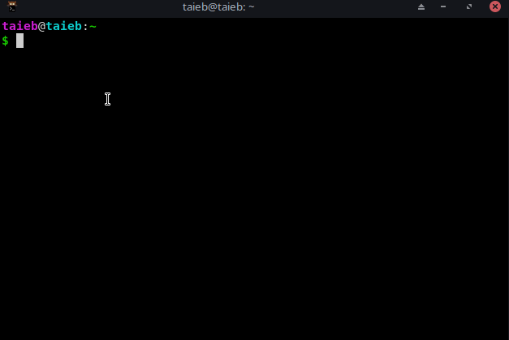
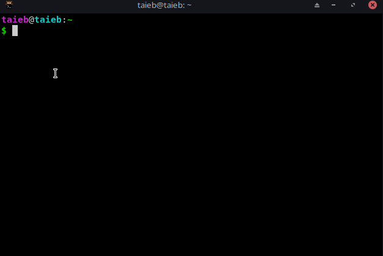
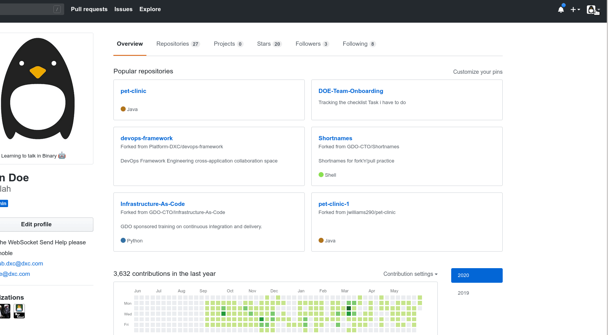
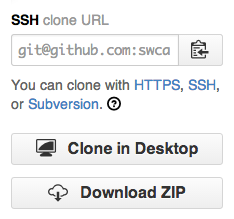

## Why Use an SSH Key?

When working with a GitHub repository, you'll regularly need to identify yourself to GitHub using your username and password. An SSH key is an substitute method to identify yourself that doesn't require you to enter your username and password every time.

SSH keys come in pairs, a public key that gets shared with services like GitHub, and a private key that will be stored on your computer. If the keys match, you're granted access.

The cryptography behind SSH keys ensures that no one can reverse engineer your private key from the public one.

## Generating an SSH key pair

The first step in using GitHub SSH authorization is to generate your own key pair.

You can check to see if one exists by moving to your `.ssh `directory and listing the contents, sometimes you might already generated an SSH key pair on your machine. 

```shell
cd ~/.ssh
ls
```

* If you find `id_rsa.pub` on your folder, it means that you already have a key pair and don't need to create a new one.

* If you don't find `id_rsa.pub`, you need to use the following command to generate a new key pair. Make sure to replace `your-username@dxc.com` with your own email address.



* **Step1:**  Open the terminal app on your computer
* **Step2:** Enter the following command, substiting your-username@dxc.com with your email address.


```shell
ssh-keygen -t rsa -b 4096 -C "your-username@dxc.com"
```


* **Step3:** When asked where to save the new key, hit enter to accept the default location.

```shell
Generating public/private rsa key pair.
Enter file in which to save the key (/Users/username/.ssh/id_rsa):
```

* **Step3:** You will then be asked to provide an optional passphrase. This can be used to make your key even more secure, but for this lesson you can skip it by hitting enter twice.


```shell
Enter passphrase (empty for no passphrase):
```
```shell
Enter same passphrase again:
```

## Adding your SSH key to the ssh-agent



To configure the ssh-agent to use your SSH key, first ensure ssh-agent is enabled.

* Open the terminal and enter: 

```shell
eval $(ssh-agent -s)
```

* Then, add your SSH key to the ssh-agent:

```shell
ssh-add ~/.ssh/id_rsa
```


## Link an SSH key to your GitHub account


### 1- Copy the SSH key to your clipboard on Windows 🔟

```shell
clip < ~/.ssh/id_rsa.pub
# Copies the contents of the id_rsa.pub file to your clipboard
```


### 1- Copy the SSH key to your clipboard on MacOS 🍏

```shell
pbcopy < ~/.ssh/id_rsa.pub
# Copies the contents of the id_rsa.pub file to your clipboard
```


### 1- Copy the SSH key to your clipboard on Linux 🐧

First of all you need to downloads and installs xclip. If you don't have `apt-get`, you might need to use another installer (like `yum`):

```shell
sudo apt-get install xclip

```

```shell
xclip -sel clip < ~/.ssh/id_rsa.pub
# Copies the contents of the id_rsa.pub file to your clipboard
```

**or**
```shell
cat ~/.ssh/id_rsa.pub
``` 
The output should look something like this:
```text
ssh-rsa AAAAB3NzaC1yc2EAAAABIwAAAQEA879BJGYlPTLIuc9/R5MYiN4yc/YiCLcdBpSdzgK9Dt0Bkfe3rSz5cPm4wmehdE7GkVFXrBJ2YHqPLuM1yx1AUxIebpwlIl9f/aUHOts9eVnVh4NztPy0iSU/Sv0b2ODQQvcy2vYcujlorscl8JjAgfWsO3W4iGEe6QwBpVomcME8IU35v5VbylM9ORQa6wvZMVrPECBvwItTY8cPWH3MGZiK/74eHbSLKA4PY3gM4GHI450Nie16yggEg2aTQfWA1rry9JYWEoHS9pJ1dnLqZU3k/8OWgqJrilwSoC5rGjgp93iu0H8T6+mEHGRQe84Nk1y5lESSWIbn6P636Bl3uQ== your-username@dxc.com
``` 

Copy the contents of the output to your clipboard.


## 2- In the upper-right corner of any page, click your profile photo, then click Settings. 

## 3- In the user settings sidebar, click SSH and GPG keys. 
## 4- Click New SSH key or Add SSH key.  
## 5- Add a Title and paste your Key on the `Key` field
## 6- Finally, hit Add key to save. Enter your github password if prompted.




### Using Your SSH Key


