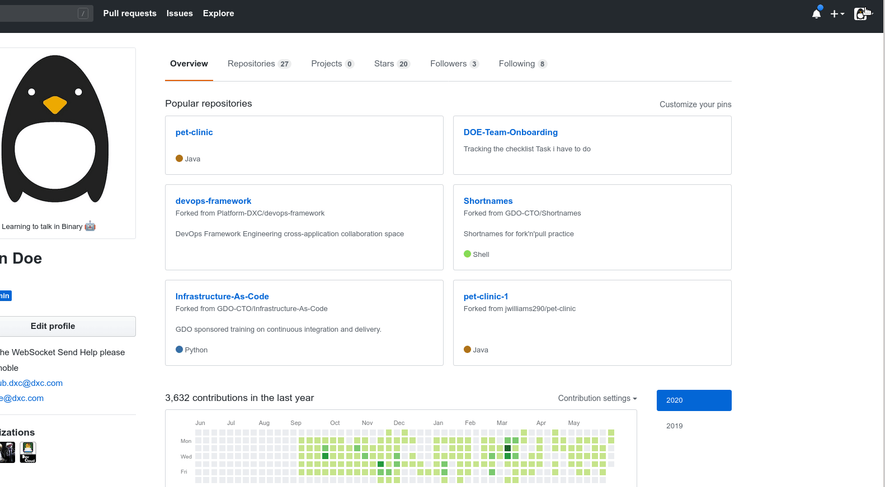

### What is PAT (Personal Access Token ) ?

A PAT is an alternative to the password you would use when accessing your account on the Git repository hosting service. 
You can generate separate tokens for each separate client you may want to use to access your account. By using a different token per client you can control what level of access each has, including whether they have read-only access, or can update repositories. 

This token will act like an ordinary OAuth access token. We use it in places where the password is necessary.
The advantage to using a token over putting your password into a script is that a token can be revoked, and you can generate lots of them.

### How to Generate a PAT on Github ? 

Go to your GitHub account settings by following the steps below:

1. Click on that and select `Settings` to go to your public profile
2. Go to `Developer Settings`
3. Choose `Personal access tokens` or you can visit this [link](https://dxc.github.com/settings/tokens)
4. Select `Generate New token` button to your right
5. Now give the new token a description
6. Define the access scope for the token.
7. Generate your personal access token.

> *Make sure to copy your new personal access token now. You won’t be able to see it again!*

> As a security precaution, GitHub automatically removes personal access tokens that haven't been used in a year.
